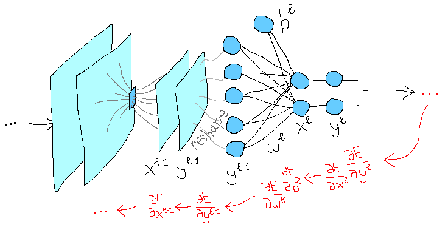

# Convolutional Neural Network from Scratch

<p align="center">
  
</p>

## About

A Python implementation of a CNN with only numpy. All theory and formulas behind the code you can read from articles - in Russian on [habr](https://habr.com/ru/company/ods/blog/344008/) and in English on [in progress].

Also, to check whether the numpy model gets plausible results, it is compared with a similar CNN architecture based on pytorch. Both models have the same initial weights and are trained on the MNIST dataset (all training images are given in the same order) - so you can compare the losses of the models after each cycle and make sure that the numpy-implementation is correct.

## Quick setup and start

* [Docker](https://www.docker.com/)


The provided [Dockerfile](Dockerfile) is supplied to build an image with all the necessary dependencies.

### Preparations

* Clone the repo.
    ```bash
    git clone git@github.com:skalinin/CNN-from-Scratch.git
    cd CNN-from-Scratch
    ```

* `sudo make all` to build a docker image and create a container.


### Run

To create identical initial weights for numpy and torch models:

```bash
python src/scripts/make_init_weights.py --torch_seed 1234
```

To start a numpy model training:

```bash
python src/scripts/train_numpy_model.py \
	--load_path /workdir/data/numpy_init_weights.npy
```

To start a torch model training:

```bash
python src/scripts/train_torch_model.py \
	--load_path /workdir/data/torch_init_weights.ckpt
```

